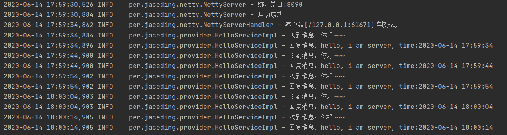
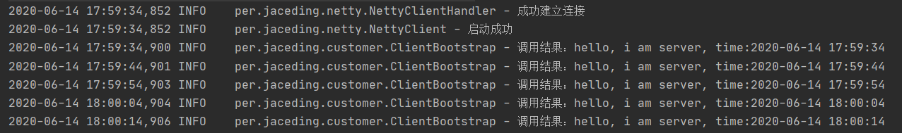

# jrpc
**jrpc** is a high-performance, java based, open source RPC framework.

[TOC]

## jrpc-helloworld

**使用netty实现一个helloworld版的rpc**

服务消费者```ClientBootstrap```只是调用```HelloService```接口的```say```方法，通过动态代理和Netty成功调用服务提供者```ServerBootstrap```的```HelloServiceImpl```的```say```实现方法并返回调用结果。

1. 先启动服务提供者```per.jaceding.provider.ServerBootstrap```

   

2. 再启动服务消费者```per.jaceding.customer.ClientBootstrap```

   

## License

**jrpc** is under the Apache 2.0 license. See the [LICENSE](https://github.com/jaceding/jrpc/blob/master/LICENSE) file for details.